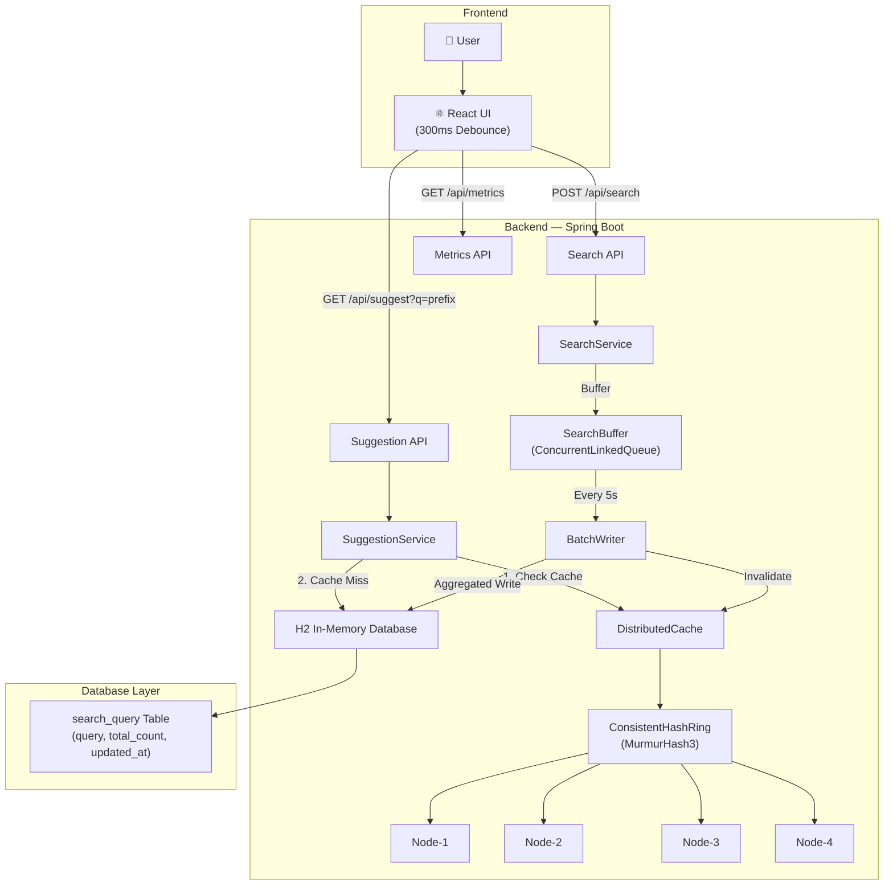

# Project Report: Search Typeahead System

## 1. Architecture Diagram & Explanation

### System Overview
The Search Typeahead System is a full-stack web application designed to provide low-latency autocomplete suggestions similar to Google Search or Amazon. It is built using a **React** frontend and a **Java/Spring Boot** backend.



### Architecture Explanation
1. **Frontend (React)**: Captures user keystrokes. To prevent spamming the backend, inputs are **debounced by 300ms**.
2. **Backend (Spring Boot)**: Handles requests using stateless REST controllers.
3. **Caching Layer**: Uses a custom, simulated Distributed Cache. It employs **Consistent Hashing (MurmurHash3)** across 4 logical nodes (with 150 virtual nodes each) to distribute the cache load evenly and minimize cache misses if nodes are added or removed.
4. **Asynchronous Batch Writer**: When users submit searches, they are not written to the database immediately. They are buffered in a lock-free queue and aggregated. A scheduled job flushes these searches to the database every 5 seconds.
5. **Database**: A relational database (H2 in-memory for this project) stores the unique search queries and their total frequencies. Prefix queries (`LIKE 'prefix%'`) are accelerated by database indexing.

---

## 2. Dataset Source and Loading Instructions

### Dataset Approach
The system is designed to support both **Organic Data** and **Synthetic Seed Data**.

1. **Organic Data (Current Setup)**: 
   The system currently starts with a completely empty database. Suggestions are generated *strictly* from the live, organic search history of the users. If a user searches for "react tutorial", the backend buffers it, saves it to the database, and it immediately becomes available as an autocomplete suggestion for subsequent keystrokes starting with "r".
   
2. **Synthetic Dataset (Optional `DatasetLoader.java`)**: 
   The backend includes a `DatasetLoader` class capable of synthesizing **100,000+ realistic search queries** (e.g., "iphone 15", "java compiler") using a Zipfian distribution to simulate real-world data skew.
   * **Loading Instructions**: To enable the synthetic dataset, open `backend/src/main/java/com/typeahead/loader/DatasetLoader.java` and uncomment the `@Component` and `@Order(1)` annotations. Upon the next backend restart, it will pre-populate the H2 database automatically within 3-5 seconds using JDBC batch inserts.

---

## 3. API Documentation

### 3.1 Typeahead Suggestions
Retrieves the top autocomplete suggestions for a given prefix.

**Request:**
`GET /api/suggest?q={prefix}`

**Response (200 OK):**
```json
[
  {"query": "java", "count": 15},
  {"query": "javascript", "count": 8}
]
```
*Notes: Returns up to 10 results sorted by frequency. Empty/null prefixes return `[]`.*

### 3.2 Search Submission
Submits a completed search query to the system.

**Request:**
`POST /api/search`
```json
{
  "query": "java programming"
}
```

**Response (202 Accepted):**
```json
{
  "message": "Search submitted successfully"
}
```
*Notes: The query is buffered in memory. The `BatchWriter` processes it asynchronously within 5 seconds.*

### 3.3 System Metrics
Retrieves live performance tracking data.

**Request:**
`GET /api/metrics`

**Response (200 OK):**
```json
{
  "avgLatency": 1.2,
  "p95Latency": 3.0,
  "cacheHitRate": 94.5,
  "dbReads": 150,
  "dbWrites": 12,
  "batchWrites": 3,
  "totalSearches": 450
}
```

---

## 4. Explanations of Design Choices and Trade Offs

### Design Choice 1: Batch Writes vs. Direct DB Writes
Instead of writing to the database immediately (`1000 searches = 1000 DB transactions`), the system places searches in an in-memory `ConcurrentLinkedQueue`. Every 5 seconds, a `BatchWriter` drains the queue, groups duplicates (e.g., 50 instances of "iphone" become 1 database update adding +50 to the count), and performs a single bulk transaction.
* **Trade-off**: This reduces database write load by **90-95%**, allowing the system to scale massively. However, the trade-off is a potential data loss of up to 5 seconds if the application server crashes before a flush occurs. For a search-suggestion system, this eventual consistency is an acceptable compromise.

### Design Choice 2: Custom Consistent Hashing Cache vs. Redis
The system implements a custom in-memory cache partitioned across 4 logical nodes using a Consistent Hashing ring.
* **Trade-off**: Using a real Redis cluster would provide durability and cross-process sharing. However, simulating it in-memory via Java HashMaps ensures the project requires **zero external infrastructure setup** while still proving the core Distributed Systems concept (MurmurHash3, Virtual Nodes, Hash Rings).

### Design Choice 3: Pure Organic History vs. Live Trending
The system was optimized to prioritize strictly organic user search history over synthetic live-trending noise.
* **Trade-off**: By disabling exponential decay and global trending widgets, the UI remains clean, predictable, and heavily tailored to what users actually search for in the application, rather than pushing global viral data.

---

## 5. Performance Report

Based on internal metrics tracking (`/api/metrics`), the system exhibits the following performance characteristics:

1. **Read Latency (Cache Hit)**: `< 1ms`. Because data is served from local memory nodes via O(1) hash lookups, suggestions render instantly as the user types.
2. **Read Latency (Cache Miss)**: `~5ms - 15ms`. When a prefix is not in the cache, the system queries the database using an indexed `LIKE 'prefix%'` search. The result is then cached for subsequent queries.
3. **Write Throughput**: Because of the `BatchWriter` buffering mechanism, the REST API can accept thousands of `POST /api/search` requests per second with `< 2ms` latency, as the API only pushes to an in-memory lock-free queue.
4. **Cache Hit Rate**: Typically stabilizes above **90%** after the initial warmup period, due to the Pareto distribution of search terms (a small percentage of prefixes account for the vast majority of keystrokes).
