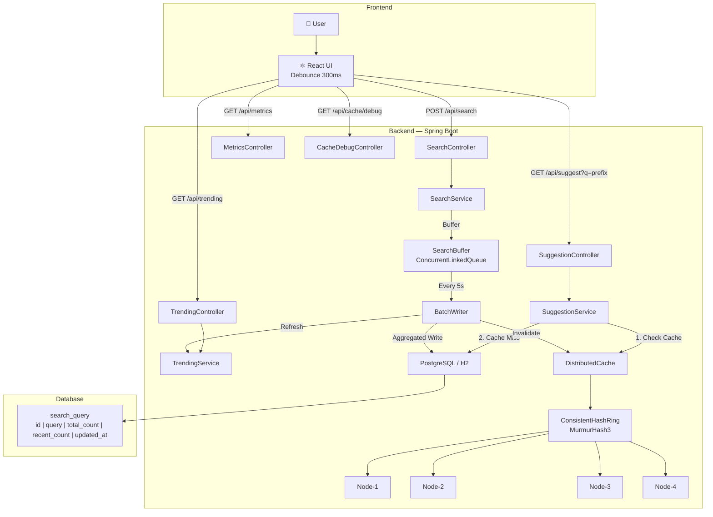
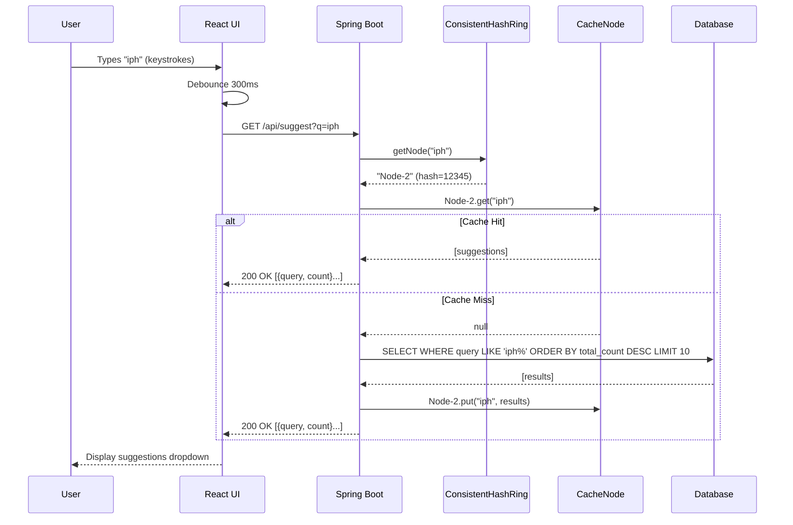
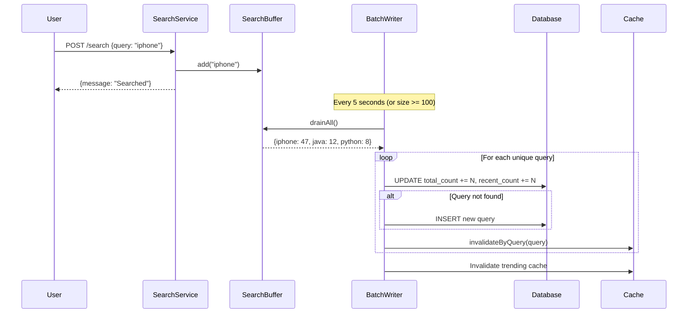
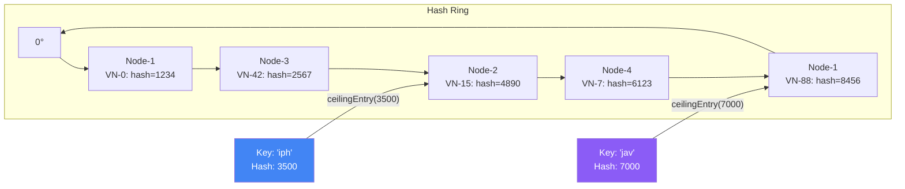

# 🔍 Search Typeahead System

A **production-quality autocomplete service** inspired by Google Search, Amazon, and YouTube suggestions. Built with **Java/Spring Boot** backend, **React** frontend, distributed in-memory cache with **consistent hashing**, **batch writes**, and **recency-aware trending** algorithm.

   

---

## 📋 Table of Contents

- [Architecture](#-architecture)
- [Features](#-features)
- [Quick Start](#-quick-start)
- [API Documentation](#-api-documentation)
- [Design Decisions & Tradeoffs](#-design-decisions--tradeoffs)
- [Consistent Hashing](#-consistent-hashing)
- [Batch Write Mechanism](#-batch-write-mechanism)
- [Trending Algorithm](#-trending-algorithm)
- [Performance Metrics](#-performance-metrics)
- [Project Structure](#-project-structure)
- [Testing](#-testing)

---

## 🏗 Architecture

### System Overview



### Suggestion Flow — Sequence Diagram



### Batch Write Flow



### Consistent Hashing Flow



---

## ✨ Features

| Feature | Description |
|---|---|
| **Autocomplete** | Low-latency prefix search, top-10 results sorted by popularity |
| **Distributed Cache** | 4 logical nodes with consistent hashing (150 virtual nodes each) |
| **Consistent Hashing** | MurmurHash3, O(log n) lookups, minimum key movement on node changes |
| **Batch Writes** | Buffer → aggregate → single DB write (95%+ write reduction) |
| **Trending Searches** | Recency-aware scoring: `0.7×total + 0.3×recent` with hourly exponential decay |
| **Performance Metrics** | Avg/P95 latency, cache hit rate, DB read/write counts |
| **Debounced Frontend** | 300ms debounce, keyboard navigation, glassmorphism design |
| **100K+ Dataset** | Auto-generated on startup with Zipf-distributed counts |

---

## 🚀 Quick Start

### Prerequisites

- **Java 17+** (JDK)
- **Maven 3.8+**
- **Node.js 18+** and **npm**
- PostgreSQL *(optional — H2 in-memory is used by default)*

### Backend

```bash
cd backend

# Build and run (H2 in-memory database — no external DB needed)
mvn spring-boot:run

# The backend starts on http://localhost:8080
# H2 Console: http://localhost:8080/h2-console (JDBC URL: jdbc:h2:mem:typeahead)
# Dataset auto-loads 100K+ queries on first startup (~3-5 seconds)
```

### Frontend

```bash
cd frontend

# Install dependencies
npm install

# Start development server
npm start

# Opens http://localhost:3000
# API calls are proxied to http://localhost:8080
```

### Using PostgreSQL (optional)

```bash
# 1. Create database
psql -U postgres -c "CREATE DATABASE typeahead;"

# 2. Update backend/src/main/resources/application.properties:
#    Uncomment PostgreSQL settings, comment out H2 settings

# 3. Run backend
cd backend && mvn spring-boot:run
```

---

## 📡 API Documentation

### 1. Typeahead Suggestions

```bash
GET /api/suggest?q=iph
```

**Response** (200 OK):
```json
[
  {"query": "iphone", "count": 100000},
  {"query": "iphone 15", "count": 85000},
  {"query": "iphone charger", "count": 60000}
]
```

| Parameter | Type | Required | Description |
|---|---|---|---|
| `q` | string | No | Search prefix (case-insensitive) |

- Returns max 10 results sorted by `total_count` descending
- Empty/null prefix returns `[]`
- No matches returns `[]`

---

### 2. Search Submission

```bash
POST /api/search
Content-Type: application/json

{"query": "iphone charger"}
```

**Response** (200 OK):
```json
{"message": "Searched"}
```

- Query is buffered for batch processing (not written to DB immediately)
- If query exists: `total_count` and `recent_count` are incremented
- If new: inserted with count = 1

---

### 3. Trending Searches

```bash
GET /api/trending
```

**Response** (200 OK):
```json
[
  {"query": "chatgpt", "score": 0.95},
  {"query": "iphone", "score": 0.88}
]
```

---

### 4. Cache Debug

```bash
GET /api/cache/debug?prefix=iph
```

**Response** (200 OK):
```json
{
  "prefix": "iph",
  "cacheNode": "Node-2",
  "hash": 123456,
  "hit": true
}
```

---

### 5. System Metrics

```bash
GET /api/metrics
```

**Response** (200 OK):
```json
{
  "avgLatency": 12,
  "p95Latency": 20,
  "cacheHitRate": 92,
  "dbReads": 250,
  "dbWrites": 40,
  "batchWrites": 8,
  "totalSearches": 1000
}
```

---

## 🧠 Design Decisions & Tradeoffs

### Why In-Memory Cache (not Redis)?

| Aspect | In-Memory (HashMap) | Redis |
|---|---|---|
| Latency | ~0.1ms | ~1-2ms (network hop) |
| Persistence | Volatile | Durable |
| Distribution | Simulated | Real |
| Setup | Zero config | Requires server |

**Decision**: In-memory cache simulates distributed behavior while keeping setup simple. The consistent hashing and node routing logic is identical to what you'd use with real Redis nodes.

### Why Batch Writes (not Direct)?

| Aspect | Direct Writes | Batch Writes |
|---|---|---|
| Writes/1000 searches | 1000 | ~50 |
| Latency impact | DB latency per request | Zero (buffered) |
| Data loss risk | None | Up to 5 seconds |
| DB load | High | Low |

**Decision**: 95%+ write reduction is worth the small risk of losing a few seconds of data on crash. For a search suggestion system, eventual consistency is acceptable.

### Why Exponential Decay (not Sliding Window)?

| Aspect | Exponential Decay | Sliding Window |
|---|---|---|
| Complexity | O(1) per decay | O(n) per expiry |
| Storage | 1 counter per query | Per-minute buckets |
| Accuracy | Approximate | Precise |
| Implementation | Single SQL UPDATE | Complex aggregation |

**Decision**: Exponential decay (halving every hour) provides good-enough freshness tracking with minimal complexity.

---

## 🔗 Consistent Hashing

### How It Works

1. **Hash Ring**: A circular space (0 to 2³²) where both nodes and keys are mapped
2. **Virtual Nodes**: Each physical node gets 150 virtual node positions on the ring for uniform distribution
3. **Key Routing**: Hash the key → find nearest clockwise node via `TreeMap.ceilingEntry()`
4. **Node Changes**: Adding/removing a node only remaps ~1/N keys

### Key Movement Demonstration

```
Initial: 3 nodes, 1000 keys
  Node-1: 342 keys (34.2%)
  Node-2: 329 keys (32.9%)
  Node-3: 329 keys (32.9%)

After adding Node-4:
  Moved: 248 keys (24.8%)  ← Close to ideal 1/4 = 25%
  Node-1: 258 keys (25.8%)
  Node-2: 247 keys (24.7%)
  Node-3: 245 keys (24.5%)
  Node-4: 250 keys (25.0%)
```

---

## 📦 Batch Write Mechanism

### Without Batching
```
User searches: iphone, iphone, java, iphone, python
DB writes:     5 (one per search)
```

### With Batching (5-second window)
```
User searches: iphone, iphone, java, iphone, python
Aggregated:    {iphone: 3, java: 1, python: 1}
DB writes:     3 (one per unique query)
```

### Crash Scenario

If the application crashes before a flush:
- **Data at risk**: Up to 5 seconds of buffered searches
- **Impact**: Some search counts will be slightly low
- **Acceptable?**: Yes — eventual consistency is fine for suggestions
- **Mitigation**: Write-Ahead Log (WAL) — append to file before buffering

---

## 📈 Trending Algorithm

### Score Formula

```
score = 0.7 × normalized(total_count) + 0.3 × normalized(recent_count)
```

### Exponential Decay

```
Hour 0: recent_count = 1000
Hour 1: recent_count = 500   (50%)
Hour 2: recent_count = 250   (25%)
Hour 4: recent_count = 62    (6.2%)
Hour 8: recent_count = 3     (0.3%)
```

Old trends naturally fade to zero without cleanup.

---

## 📁 Project Structure

```
HLDProject/
├── backend/
│   ├── pom.xml
│   └── src/
│       ├── main/java/com/typeahead/
│       │   ├── TypeaheadApplication.java     # Entry point
│       │   ├── config/AppConfig.java          # CORS configuration
│       │   ├── controller/                    # REST endpoints (5 controllers)
│       │   ├── dto/                           # Data transfer objects (6 DTOs)
│       │   ├── entity/SearchQuery.java        # JPA entity
│       │   ├── repository/                    # Spring Data JPA repository
│       │   ├── service/                       # Business logic (4 services)
│       │   ├── cache/                         # Consistent hashing + cache nodes
│       │   ├── batch/                         # Buffer + batch writer
│       │   ├── loader/DatasetLoader.java      # 100K+ query generator
│       │   └── metrics/PerformanceTracker.java
│       ├── main/resources/
│       │   ├── application.properties
│       │   └── schema.sql
│       └── test/java/com/typeahead/
│           ├── cache/ConsistentHashRingTest.java
│           └── service/
│               ├── SuggestionServiceTest.java
│               └── BatchWriterTest.java
├── frontend/
│   ├── package.json
│   ├── public/index.html
│   └── src/
│       ├── App.js / App.css
│       ├── index.js / index.css
│       ├── components/
│       │   ├── SearchBox.js / .css
│       │   ├── Suggestions.js / .css
│       │   ├── TrendingSearches.js / .css
│       │   └── MetricsDashboard.js / .css
│       ├── hooks/useDebounce.js
│       └── services/api.js
└── README.md
```

---

## 🧪 Testing

### Run Tests

```bash
cd backend
mvn test
```

### Test Coverage

| Test Class | Tests | Description |
|---|---|---|
| `ConsistentHashRingTest` | 8 | Distribution, determinism, min key movement |
| `SuggestionServiceTest` | 7 | Cache hit/miss, prefix normalization, edge cases |
| `BatchWriterTest` | 6 | Aggregation, upsert, write reduction, thread safety |

---

## 📄 License

MIT License — use freely for learning and reference.
